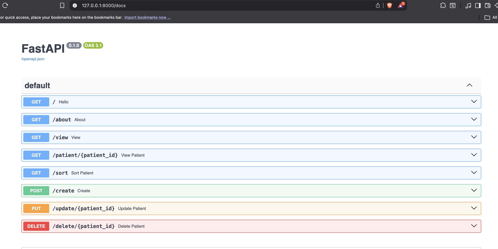
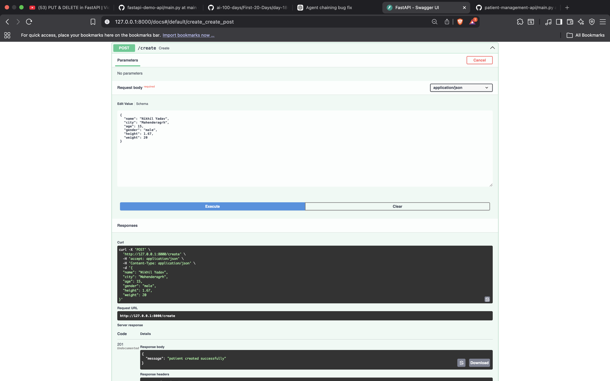
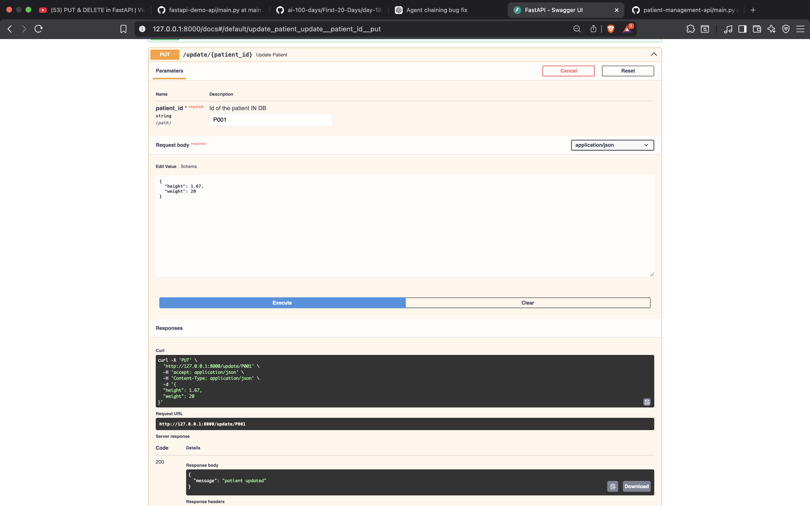

# Patient Management System API

A RESTful Patient Management System built using **FastAPI** and **Pydantic**. The project demonstrates CRUD operations, request validation, computed fields, and JSON-based data persistence.

## Features

- Create a patient
- View all patients
- View patient by ID
- Update patient details
- Delete a patient
- Sort patients by:
  - Height
  - Weight
  - BMI
- Automatic BMI calculation
- Automatic health verdict
- Duplicate patient detection
- Input validation using Pydantic

---

## Technologies Used

- Python 3.12
- FastAPI
- Pydantic v2
- JSON File Storage

---

## Installation

Clone the repository:

```bash
git clone https://github.com/<your-username>/patient-management-api.git
```

Go to project directory:

```bash
cd patient-management-api
```

Install dependencies:

```bash
pip install -r requirements.txt
```

Run the server:

```bash
uvicorn main:app --reload
```

---

## API Documentation

Swagger UI

```
http://127.0.0.1:8000/docs
```

ReDoc

```
http://127.0.0.1:8000/redoc
```

---

## Available Endpoints

| Method | Endpoint | Description |
|---------|----------|-------------|
| GET | `/` | Home |
| GET | `/about` | About API |
| GET | `/view` | View all patients |
| GET | `/patient/{patient_id}` | View patient by ID |
| GET | `/sort` | Sort patients |
| POST | `/create` | Create patient |
| PUT | `/update/{patient_id}` | Update patient |
| DELETE | `/delete/{patient_id}` | Delete patient |

---

## Example Request

```json
{
    "name": "Nikhil",
    "city": "Mahendergarh",
    "age": 22,
    "gender": "male",
    "height": 1.75,
    "weight": 70
}
```

---

## Example Response

```json
{
    "name": "Nikhil",
    "city": "Mahendergarh",
    "age": 22,
    "gender": "male",
    "height": 1.75,
    "weight": 70,
    "bmi": 22.86,
    "verdict": "Normal"
}
```

---

## Project Highlights

- RESTful API Design
- CRUD Operations
- JSON-based Storage
- Computed Fields (`@computed_field`)
- Partial Updates (`exclude_unset=True`)
- Automatic Patient ID Generation
- Exception Handling
- Request Validation
- Swagger Documentation

---
## API Preview

### Swagger API Documentation



### Create Patient Endpoint



### Update Patient Endpoint



## Future Improvements

- SQLite/PostgreSQL Database
- SQLAlchemy ORM
- Authentication
- Pagination
- Search API
- Docker Support
- Unit Testing

---

## License

This project is licensed under the **MIT License**.

You are free to:

- Use the project for personal or commercial purposes
- Modify the source code
- Distribute copies
- Create derivative works

The only requirement is to include the original copyright notice and the MIT License in any substantial portions of the software.

For more details, see the `LICENSE` file.
